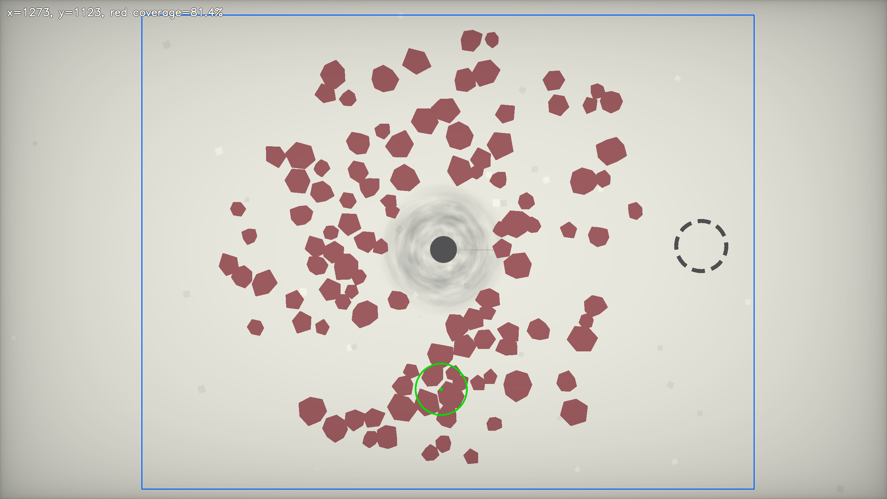

# Black Hole Zen Mode Aim Helper

> 用于《[A Game About Feeding A Black Hole](https://store.steampowered.com/app/3694480/A_Game_About_Feeding_A_Black_Hole/)》禅意模式（**Zen Mode**）的本地屏幕识别与鼠标定位脚本。

该脚本截取指定显示器画面，识别场景中的砖红色多边形，并通过寻找一个固定半径圆内砖红色面积最大的鼠标位置近似找到最优位置。

本项目仅是基于屏幕图像的计算机视觉实验，不读取或修改游戏内存、文件或网络数据，也不属于游戏开发者或发行商的官方工具。请仅在允许自动化输入的环境中自行使用。




## 功能

- 基于 HSV 的砖红色目标识别。
- 固定半径圆盘卷积，直接寻找红色覆盖最密的位置。
- 限制有效搜索范围，避开两侧不生成目标的区域。
- 可选调试图输出，显示实际搜索区域与推荐位置。
- 支持连续循环计算与移动。
- 支持 PyAutoGUI 左上角紧急停止。
- 在 Windows 下尝试启用 DPI Awareness，减少截图坐标与鼠标坐标不一致的问题。

## 环境要求 / Requirements

- 推荐在 Windows 上使用。
- 推荐 Python 3.10 或更高版本。
- 游戏应保持可见，并位于 `MONITOR_INDEX` 指定的显示器上。
- 初始参数依据 `2048 × 1152` 的 PrintScreen 截图校准。游戏缩放、窗口大小或分辨率改变后，需要重新校准半径和搜索区域。

安装依赖：

```bash
pip install opencv-python mss pyautogui numpy
```

## 快速开始 / Quick Start

1. 启动游戏的禅意模式，并确保游戏画面在目标显示器上可见。
2. 下载并打开main.py。第一次运行前，建议先使用安全配置确认框选大小：

```python
MOVE_MOUSE = False
SAVE_DEBUG_IMAGE = True
LOOP = False
```

3. 运行：

```bash
python main.py
```

4. 脚本会生成 `aim_debug.png`。检查结果是否合理：

   - 蓝色矩形表示允许搜索的区域。
   - 绿色圆表示脚本选择的消除圈位置。
   - 左上角文字显示推荐圆心坐标与圆内红色覆盖率。

5. 确认绿色圆与游戏内真实有效的鼠标消除圈匹配后，再启用自动移动与连续模式：

```python
MOVE_MOUSE = True
LOOP = True
```

## 配置说明 / Configuration

| 参数 | 默认值 | 含义 |
|---|---:|---|
| `RADIUS` | `74` | 调试图中绿色圆的视觉半径，单位为像素。 |
| `EFFECTIVE_RADIUS` | `74` | 实际参与优化计算的半径。这个参数最重要。 |
| `SEARCH_X_MIN_RATIO` | `0.16` | 有效搜索区域左边界，占截图宽度的比例。 |
| `SEARCH_X_MAX_RATIO` | `0.85` | 有效搜索区域右边界，占截图宽度的比例。 |
| `SEARCH_Y_MIN_RATIO` | `0.03` | 有效搜索区域上边界，占截图高度的比例。 |
| `SEARCH_Y_MAX_RATIO` | `0.98` | 有效搜索区域下边界，占截图高度的比例。 |
| `MOVE_MOUSE` | `True` | 是否在计算后移动鼠标。 |
| `SAVE_DEBUG_IMAGE` | `False` | 是否输出 `aim_debug.png` 调试图。 |
| `LOOP` | `True` | 是否持续循环截图、计算和移动。 |
| `INTERVAL` | `0.5` | 循环模式下每次计算后的等待时间，单位为秒。 |
| `MONITOR_INDEX` | `1` | `mss` 所截取的显示器编号。主显示器通常为 `1`。 |
| `MOVE_DURATION` | `0.0` | 鼠标移动时间，`0.0` 表示立即移动。 |
| `MIN_RED_COVERAGE` | `0.03` | 圆内红色占比低于此值时不移动鼠标。 |

## 半径校准 / Radius Calibration

当前默认参数基于 `2048 × 1152` 的截图，其中虚线消除圈半径约为：

```python
RADIUS = 74
EFFECTIVE_RADIUS = 74
```

当游戏画面等比例缩放时，可以按游戏画面宽度同步缩放：

\[
R_{\text{new}}
\approx
74 \times \frac{W_{\text{new}}}{2048}.
\]

参考值如下：

| 游戏画面尺寸 | 建议半径 |
|---|---:|
| `1600 × 900` | `58` |
| `1920 × 1080` | `69` |
| `2048 × 1152` | `74` |
| `2560 × 1440` | `93` |
| `3840 × 2160` | `139` |

若游戏实际判定范围略小于视觉上的虚线圆，建议保守设置：

```python
RADIUS = 74
EFFECTIVE_RADIUS = 70
```

其中，`EFFECTIVE_RADIUS` 控制优化算法使用的半径。当前脚本里的 `RADIUS` 主要用于绘制调试图中的绿色圆。

## 搜索范围校准 / Search Region Calibration

脚本默认只在中间大部分区域中寻找圆心：

```python
SEARCH_X_MIN_RATIO = 0.16
SEARCH_X_MAX_RATIO = 0.85
SEARCH_Y_MIN_RATIO = 0.03
SEARCH_Y_MAX_RATIO = 0.98
```

这样可以避开左右两侧基本不会生成多边形的区域。

若游戏窗口不是全屏，浏览器或系统缩放比例发生变化，或者显示器的纵横比不同，先启用：

```python
SAVE_DEBUG_IMAGE = True
```

然后检查 `aim_debug.png` 中的蓝色矩形。蓝框应覆盖实际多边形生成区域，同时尽量排除明显不会生成目标的边缘空白区。

例如，在超宽屏中，左右留白比例更高时，可能需要改为：

```python
SEARCH_X_MIN_RATIO = 0.22
SEARCH_X_MAX_RATIO = 0.78
```

## 全屏和窗口模式 / Full-screen and Windowed Mode

当前版本截取整个指定显示器：

```python
monitor = sct.monitors[MONITOR_INDEX]
```

如果游戏只占据桌面中的一个窗口，建议改为只截取游戏画面区域，以减少其他界面元素被误识别的风险。将上面的代码替换为：

```python
monitor = {
    "left": 300,
    "top": 180,
    "width": 1400,
    "height": 780,
}
```

其中四个数字分别表示游戏画面左上角的桌面坐标，以及游戏画面的宽度和高度。请按自己的实际窗口位置测量和修改。

此时半径应根据 `monitor["width"]` 的缩放比例校准，而不是根据整个显示器宽度校准。

## 停止程序 / Stop the Program

有两种正常停止方式：

- 在终端中按 `Ctrl+C`。
- 将鼠标移动到主显示器左上角，通常是坐标 `(0, 0)`。


## 已知限制 / Limitations

- 当前优化目标是“圆内砖红色像素面积最大”，而不是严格的“接触到的独立多边形数量最多”。因此，一个面积很大的红色图形可能会被优先于多个总面积较小的图形。
- 色彩阈值按当前禅意模式中砖红色多边形的视觉效果设定。若游戏画面滤镜、亮度、配色或 UI 发生明显变化，可能需要调整 `extract_red_mask()` 中的 HSV 阈值。
- 彼此接触或非常靠近的多边形会被视为连续红色区域。这不影响“红色覆盖面积最大”的目标，但会影响基于独立对象数量的计分目标。
- 脚本不会自动定位游戏窗口。
- 脚本仅执行屏幕截图和鼠标移动，不会点击鼠标，不会修改游戏文件、内存或网络数据。

## 文件结构 / Project Layout

```text
.
├── main.py                 # 截图、颜色识别、圆盘卷积优化和鼠标移动
├── README.md               # 项目说明
└── aim_debug_sample.png    # README 中的调试图示例，可选
```
